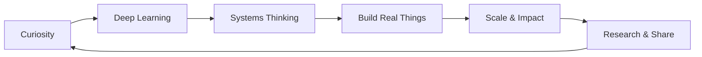

<!-- ================= HERO HEADER ================= -->

  

  

  <b>BTech CSE (Cloud Computing & Virtualization Technology) @ UPES • Dehradun, India</b> 
  <b>Cloud × AI/ML × Security × Systems</b>

---

## ⚡ Who I Am

I’m **Nitanshu**, a systems-focused engineer building:

- Autonomous cloud platforms  
- ML-driven threat detection engines  
- Self-healing infrastructure  
- AI observability agents  
- Custom Linux operating systems  

I don’t build “apps for marks”.  
I build **infrastructure that thinks, detects, and heals**.

---

```mermaid
graph LR
    A[Curiosity] --> B[Deep Learning]
    B --> C[Systems Thinking]
    C --> D[Build Real Things]
    D --> E[Scale & Impact]
    E --> F[Research & Share]
    F --> A
```

---

## ⚙️ Tech Arsenal

  

---

## 🚨 Project Highlights

| Project | Domain | Core Tech | Description |
|--------|--------|-----------|-------------|
| Helios | AI Security | Python, AWS | ML anomaly detection & self-healing |
| Quantum Cloud | Quantum + Cloud | Qiskit, AWS | QAOA-based scheduling |
| MediFlow AI | GenAI Healthcare | Next.js, Claude API | 5-agent automation |
| Atlas SRE | Kubernetes | AWS EKS | Self-healing infra |
| NitanshuOS | OS Engineering | Linux Kernel | Custom distro |

---

## 📊 GitHub Stats

  

---

## 🌐 Connect

---

  

