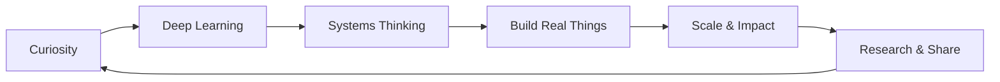

<p align="center">
  
</p>

<p align="center">
  
</p>

<p align="center">
  <a href="https://www.linkedin.com/in/nitanshu-tak-89a1ba289/">
    
  </a>
  &nbsp;
  <a href="https://github.com/Nitanshu715">
    
  </a>
  &nbsp;
  <a href="mailto:nitanshutak070105@gmail.com">
    
  </a>
  &nbsp;
  <a href="https://leetcode.com/u/Nitanshu_tak070105/">
    
  </a>
  &nbsp;
  <a href="https://unstop.com/u/nitanshu715">
    
  </a>
</p>

---

## ⚡ Who I Am

<p align="center">
  
</p>

<p align="center">
  <b>BTech CSE (Cloud Computing & Virtualization Technology) @ UPES &bull; Dehradun, India &bull; 2023&ndash;2027</b>
</p>

```yaml
name        :  Nitanshu Tak
role        :  SDE — Backend & DevOps Specialist @ SapMen C.
degree      :  BTech CSE (Cloud Computing & Virtualization Technology)  |  UPES Dehradun  |  CGPA: 8.02
research    :  ICATEET 2026 — "Helios: AI-Enabled Secure Cloud Infrastructure"
domains     :  Cloud Engineering · AI/ML · DevOps · Cybersecurity · Systems · Quantum Computing
philosophy  :  "I don't build apps for marks. I build infrastructure that thinks, detects, and heals."
```

<div align="center">


```mermaid
graph LR
    A[Curiosity] --> B[Deep Learning]
    B --> C[Systems Thinking]
    C --> D[Build Real Things]
    D --> E[Scale & Impact]
    E --> F[Research & Share]
    F --> A
```

</div>

---

## ⚙️ Tech Arsenal

<p align="center">
  
</p>

<p align="center">
  
</p>

---

## 🚨 Project Highlights

<p align="center">
  
</p>

| &nbsp; | Project | Domain | Stack | Impact |
|:---:|:---|:---|:---|:---|
| ⚡ | [**Helios**](https://github.com/Nitanshu715/Helios) | AI Security + Self-Healing | Python · Flask · scikit-learn · AWS EC2/S3/CloudWatch/SNS | 5 ML models · >95% accuracy · Real-time auto-recovery · **ICATEET 2026** |
| 🌌 | [**Quantum-Cloud**](https://github.com/Nitanshu715/Quantum-Cloud) | Quantum + Cloud Scheduling | Python · Qiskit · QAOA · AWS Braket · FastAPI · Streamlit | QUBO Hamiltonian scheduler · **35% better than greedy** · Nat. Quantum Hackathon 2025 |
| 🏥 | [**MediFlow AI**](https://github.com/Nitanshu715/MediFlow-AI) | GenAI + Healthcare Automation | Next.js 14 · TypeScript · Claude API · Vercel | 5-agent pipeline · Clinical NLP → Claims Audit · **6 hrs → 28 sec** · ET GenAI Hackathon 2026 |
| ☸️ | [**ATLAS-SRE**](https://github.com/Nitanshu715/Atlas-SRE) | SRE + Kubernetes | AWS EKS · Prometheus · Grafana · ALB · Docker | Production K8s · Failure injection · **99.9% uptime · 65% MTTD reduction** |
| 🐧 | [**NitanshuOS**](https://github.com/Nitanshu715/NitanshuOS) | OS Engineering | Linux 5.10 · Buildroot · GRUB · BusyBox · QEMU · Docker | Custom Linux distro from scratch · **>60% smaller** than standard distros · Boots on QEMU |
| 🌡️ | [**SuryaDrishti**](https://github.com/Nitanshu715/SuryaDrishti) | Geospatial AI + Remote Sensing | Python · scikit-learn · Rasterio · GDAL · Flask · Landsat 9 | **95.99% accuracy · F1=0.962** · 1.45M satellite pixels · Delhi Urban Heat Island · ISRO/NRSC |
| 💰 | [**Navika**](https://github.com/Nitanshu715/Navika) | RAG + Finance | Python · FAISS · MiniLM · Gemini API · Reflex · SHA-256 | 384-dim embeddings · **MRR=0.812 · 90% Hit@5** · Top 100/7,000+ teams · Hack For Green Bharat |
| 🤖 | [**ARES**](https://github.com/Nitanshu715/ARES-Autonomous-Reliability-Engineering-System) | Autonomous SRE | Next.js · TypeScript · Python · Docker Engine API · Prometheus | MAPE-K control plane · Multi-agent self-healing · **108+ Vercel deployments** |
| 🛡️ | [**Kevlar**](https://github.com/Nitanshu715/Kevlar) | Cybersecurity + Browser Security | Python · Flask · Random Forest · Chrome Manifest V3 | 4-layer browser defense · ~96% phishing accuracy (96k URLs) · **Ideathon Finalist** |
| 🧮 | [**SentinelAI**](https://github.com/Nitanshu715/SentinelAI-Containerized-DevOps-Incident-Intelligence-System) | DevSecOps + Containers | FastAPI · PostgreSQL 15 · Docker Compose · Macvlan | Multi-stage Dockerfile · Isolation Forest endpoint · Named volume persistence |
| ☁️ | [**NebulaStack**](https://github.com/Nitanshu715/NebulaStack) | Cloud IaC | AWS EC2 · RDS · Docker · Terraform · ECR | Git SHA versioning · Terraform-only IaC · SSL RDS · IAM least-privilege |
| ⚙️ | [**Cloud DSL Compiler**](https://github.com/Nitanshu715/CloudProjectSynopsisPart1.docx) | Systems + Compilers | Python · PLY · ANTLR4 · Jinja2 · Docker · K8s | Full 6-phase compiler · **150 lines → 5 lines** · Emits Dockerfile + K8s YAML + CloudFormation |

<p align="center">
  
</p>

---

## 📊 GitHub Activity

<p align="center">
  
  &nbsp;&nbsp;
  
</p>

<p align="center">
  
</p>

---

## 🏆 Achievements & Recognition

```
 University Rank 2 on Unstop   ·   Global Top 0.21%   ·   Unstop Talent Awards 2026 Nominee
 ICATEET 2026 — International Conference Presenter — Helios: AI-Enabled Secure Cloud Infrastructure
 Google Cloud Arcade 2025 — Diamond League · Trooper Tier · 14,852 points
 Hack For Green Bharat — Top 100 / 7,000+ teams  (Navika RAG Finance Platform)
 ET GenAI Hackathon 2026 — Phase 2 Shortlisted  (MediFlow AI — Problem Statement 5)
 National Quantum Computing Hackathon 2025 — Round 2  (Quantum-Cloud QCRS)
 Ideathon Finalist (Solo) — Kevlar — presented to industry professionals
 Campus Ambassador — IIT Roorkee E-Summit 2026 · IIM Indore IRIS · IIT Delhi EDC
```

---

## 🎓 Certifications

<p align="center">
  
  &nbsp;
  
</p>

<p align="center">
  
  &nbsp;
  
  &nbsp;
  
</p>

---

## 🌐 Connect

<p align="center">
  <a href="https://github.com/Nitanshu715">
    
  </a>
  &nbsp;
  <a href="https://www.linkedin.com/in/nitanshu-tak-89a1ba289/">
    
  </a>
  &nbsp;
  <a href="mailto:nitanshutak070105@gmail.com">
    
  </a>
</p>

---

<p align="center">
  
</p>

<p align="center">
  <b>Infrastructure whispers before collapse. I engineer the systems that listen.</b>
</p>
