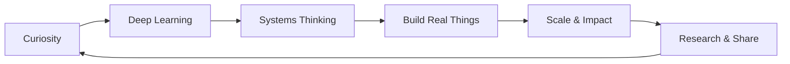

<div align="center">


</div>

<p align="center">
  
</p>

<p align="center">
  <a href="https://www.linkedin.com/in/nitanshu-tak-89a1ba289/">
    
  </a>
  &nbsp;
  <a href="https://github.com/Nitanshu715">
    
  </a>
  &nbsp;
  <a href="mailto:nitanshutak070105@gmail.com">
    
  </a>
  &nbsp;
  <a href="https://leetcode.com/u/Nitanshu_tak070105/">
    
  </a>
</p>

---

## ⚡ Who I Am

<p align="center">
  
</p>

<p align="center">
  <b>BTech CSE (Cloud Computing & Virtualization Technology) @ UPES • Dehradun, India</b><br/>
  <b>Cloud × AI/ML × Security × Systems × Quantum</b>
</p>

```yaml
name        :  Nitanshu Tak
role        :  SDE — Backend & DevOps Specialist @ SapMen C.
degree      :  BTech CSE (CCVT)  |  UPES Dehradun  |  2023–2027  |  CGPA: 8.02
research    :  ICATEET 2026 — "Helios: AI-Enabled Secure Cloud Infrastructure"
philosophy  :  "I don't build apps for marks. I build infrastructure that thinks, detects, and heals."
```

<div align="center">


```mermaid
graph LR
    A[Curiosity] --> B[Deep Learning]
    B --> C[Systems Thinking]
    C --> D[Build Real Things]
    D --> E[Scale & Impact]
    E --> F[Research & Share]
    F --> A
```

</div>

---

## ⚙️ Tech Arsenal

<p align="center">
  
</p>

<p align="center">
  
</p>

---

## 🚨 Project Highlights

<p align="center">
  
</p>

| 🔴 | Project | Domain | Core Tech | What It Actually Does |
|:--:|---------|--------|-----------|----------------------|
| ⚡ | [**Helios**](https://github.com/Nitanshu715/Helios) | AI Security + Self-Healing | Python · Flask · scikit-learn · AWS EC2 · S3 · CloudWatch · SNS | 5 ML models (CPU, Network, Login, Injection, Storage). **>95% accuracy.** Real-time alerts + recovery pipeline. Published at **ICATEET 2026**. |
| 🌌 | [**Quantum-Cloud**](https://github.com/Nitanshu715/Quantum-Cloud) | Quantum + Cloud | Python · Qiskit · QAOA · AWS Braket · FastAPI · Streamlit | QUBO Hamiltonian cloud scheduler via QAOA. **35% better** than greedy baseline. Nat. Quantum Hackathon 2025. |
| 🏥 | [**MediFlow AI**](https://github.com/Nitanshu715/MediFlow-AI) | GenAI · Healthcare | Next.js 14 · TypeScript · Claude API · Vercel | 5-agent autonomous pipeline. Clinical NLP → Compliance → Auth → Claims → Audit. **6 hrs → 28 sec.** ET GenAI Hackathon 2026. |
| ☸️ | [**ATLAS-SRE**](https://github.com/Nitanshu715/Atlas-SRE) | SRE · Kubernetes | AWS EKS · Prometheus · Grafana · ALB · Docker | Production K8s cluster. Failure injection + self-healing. **99.9% availability · 65% MTTD reduction.** |
| 🐧 | [**NitanshuOS**](https://github.com/Nitanshu715/NitanshuOS) | OS Engineering | Linux Kernel 5.10 · Buildroot · GRUB · BusyBox · QEMU · Docker | Custom Linux distro from scratch. 5-stage automated disk pipeline. Boots in QEMU. **>60% smaller** than standard distros. |
| 🌡️ | [**SuryaDrishti**](https://github.com/Nitanshu715/SuryaDrishti) | Geospatial AI | Python · scikit-learn · Rasterio · GDAL · Flask · Landsat 9 | Random Forest on 1.45M satellite pixels. **95.99% accuracy · F1=0.962.** Delhi Urban Heat Island mapping. ISRO/NRSC portfolio. |
| 💰 | [**Navika**](https://github.com/Nitanshu715/Navika) | RAG · Finance | Python · FAISS · MiniLM · Gemini API · Reflex | MiniLM 384-dim + FAISS. Gemini 2.5 Flash grounded inference. **MRR=0.812 · 90% Hit@5.** Top 100 / 7,000+ teams. |
| 🤖 | [**ARES**](https://github.com/Nitanshu715/ARES-Autonomous-Reliability-Engineering-System) | Autonomy · SRE | Next.js · TypeScript · Python · Docker · Prometheus | MAPE-K control plane. Multi-agent healing. Docker Engine API remediation. **108+ Vercel deployments.** |
| 🛡️ | [**Kevlar**](https://github.com/Nitanshu715/Kevlar) | Cybersecurity | Python · Flask · Random Forest · Chrome MV3 | 4-layer browser security. ML phishing (96k URLs, ~96% acc) + URL risk + HTTPS/tracker + scam text. **Ideathon Finalist.** |
| 🧮 | [**SentinelAI**](https://github.com/Nitanshu715/SentinelAI-Containerized-DevOps-Incident-Intelligence-System) | DevOps · Containers | FastAPI · PostgreSQL · Docker Compose · Macvlan | Multi-stage Docker · Macvlan networking · Isolation Forest anomaly endpoint · Named volume persistence. |
| ☁️ | [**NebulaStack**](https://github.com/Nitanshu715/NebulaStack) | Cloud IaC | AWS EC2 · RDS · Docker · Terraform · ECR | Git SHA image versioning · Terraform-only provisioning · SSL RDS · IAM least-privilege. |
| ⚙️ | **Cloud DSL Compiler** | Systems · Compilers | Python · PLY · ANTLR4 · Jinja2 · Docker · K8s | Full 6-phase DSL compiler (Lexer→AST→Codegen) → Dockerfile + K8s YAML + CloudFormation. **150 lines → 5 lines.** |

<p align="center">
  
</p>

---

## 📊 GitHub Activity

<p align="center">
  
  &nbsp;
  
</p>

<p align="center">
  
</p>

---

## 🏆 Achievements & Recognition

```
🥇  University Rank 2 on Unstop · Global Top 0.21% · Unstop Talent Awards 2026 Nominee
🎤  ICATEET 2026 — International Conference Presenter — Helios: AI-Enabled Secure Cloud Infrastructure
☁️  Google Cloud Arcade 2025 — Diamond League · Trooper Tier · 14,852 points
🌱  Hack For Green Bharat — Top 100 / 7,000+ teams (Navika Platform)
⚡  ET GenAI Hackathon 2026 — Phase 2 Shortlisted (MediFlow AI — PS-5)
🔬  National Quantum Computing Hackathon 2025 — Round 2 (QCRS)
🛡️  Ideathon Finalist (Solo) — Kevlar — presented to industry professionals
🎓  Campus Ambassador — IIT Roorkee E-Summit 2026 · IIM Indore IRIS · IIT Delhi EDC
```

---

## 🎓 Certifications

<p align="center">
  
  
  
</p>
<p align="center">
  
  
</p>

---

## 🌐 Connect

<p align="center">
  <a href="https://github.com/Nitanshu715">
    
  </a>
  &nbsp;
  <a href="https://www.linkedin.com/in/nitanshu-tak-89a1ba289/">
    
  </a>
  &nbsp;
  <a href="mailto:nitanshutak070105@gmail.com">
    
  </a>
</p>

---

<p align="center">
  
</p>

<p align="center">
  <b>Infrastructure whispers before collapse. I engineer the systems that listen.</b>
</p>
