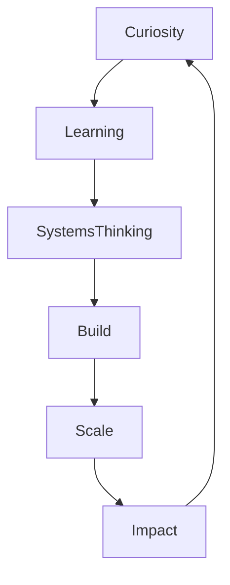

<p align="center">
  
</p>

<p align="center">
  
</p>

<p align="center">
  <a href="https://www.linkedin.com/in/nitanshu-tak-89a1ba289/"></a>
  &nbsp;
  <a href="https://github.com/Nitanshu715"></a>
  &nbsp;
  <a href="mailto:nitanshutak070105@gmail.com"></a>
  &nbsp;
  <a href="https://leetcode.com/u/Nitanshu_tak070105/"></a>
</p>

---

## ⚡ Who I Am

I'm **Nitanshu**, a systems-focused engineer building:

- Autonomous cloud platforms and self-healing infrastructure
- ML-driven threat detection and anomaly engines
- AI observability agents and multi-agent GenAI pipelines
- Custom Linux operating systems from kernel to bootloader
- Quantum-classical hybrid scheduling systems

I don't build "apps for marks". I build **infrastructure that thinks, detects, and heals.**

---

<div align="center">


```mermaid
graph TD
    Curiosity --> Learning
    Learning --> SystemsThinking
    SystemsThinking --> Build
    Build --> Scale
    Scale --> Impact
    Impact --> Curiosity
```

</div>

---

## ⚙️ Tech Arsenal

<p align="center">
  
</p>

<p align="center">
  
</p>

---

## 🚨 Project Highlights

| Project | Domain | Core Tech | What It Actually Does |
|--------|--------|-----------|----------------------|
| [**Helios**](https://github.com/Nitanshu715/Helios) | AI Security + Self-Healing | Python · Flask · scikit-learn · AWS EC2/S3/CloudWatch/SNS | 5 ML models (CPU, Network, Login, Injection, Storage). >95% accuracy. Real-time auto-recovery pipeline. Published at **ICATEET 2026**. |
| [**Quantum-Cloud**](https://github.com/Nitanshu715/Quantum-Cloud) | Quantum + Cloud Scheduling | Python · Qiskit · QAOA · AWS Braket · FastAPI · Streamlit | QUBO Hamiltonian cloud scheduler. **35% better than greedy** baseline. National Quantum Computing Hackathon 2025. |
| [**MediFlow AI**](https://github.com/Nitanshu715/MediFlow-AI) | GenAI + Healthcare | Next.js 14 · TypeScript · Claude API · Vercel | 5-agent autonomous claims pipeline. Clinical NLP → Compliance → Auth → Adjudication → Audit. **6 hrs → 28 sec.** ET GenAI Hackathon 2026. |
| [**ATLAS-SRE**](https://github.com/Nitanshu715/Atlas-SRE) | SRE + Kubernetes | AWS EKS · Prometheus · Grafana · ALB · Docker | Production K8s cluster. Failure injection + verified self-healing. **99.9% uptime · 65% MTTD reduction.** |
| [**NitanshuOS**](https://github.com/Nitanshu715/NitanshuOS) | OS Engineering | Linux 5.10 · Buildroot · GRUB · BusyBox · QEMU · Docker | Custom Linux distro built from scratch. 5-stage automated disk pipeline. Boots on QEMU. **>60% smaller** than standard distros. |
| [**SuryaDrishti**](https://github.com/Nitanshu715/SuryaDrishti) | Geospatial AI | Python · scikit-learn · Rasterio · GDAL · Flask · Landsat 9 | Random Forest on 1.45M satellite pixels. **95.99% accuracy · F1=0.962.** Delhi Urban Heat Island mapping. ISRO/NRSC portfolio. |
| [**Navika**](https://github.com/Nitanshu715/Navika) | RAG + Finance | Python · FAISS · MiniLM · Gemini API · Reflex | MiniLM 384-dim embeddings + FAISS. Gemini 2.5 Flash grounded inference. **MRR=0.812 · 90% Hit@5.** Top 100 / 7,000+ teams. |
| [**ARES**](https://github.com/Nitanshu715/ARES-Autonomous-Reliability-Engineering-System) | Autonomous SRE | Next.js · TypeScript · Python · Docker Engine API · Prometheus | MAPE-K control plane. Multi-agent self-healing. Docker Engine API remediation. **108+ Vercel deployments.** |
| [**Kevlar**](https://github.com/Nitanshu715/Kevlar) | Cybersecurity | Python · Flask · Random Forest · Chrome Manifest V3 | 4-layer browser security suite. ~96% phishing accuracy on 96k URLs. URL risk + HTTPS + scam text layers. **Ideathon Finalist.** |
| [**SentinelAI**](https://github.com/Nitanshu715/SentinelAI-Containerized-DevOps-Incident-Intelligence-System) | DevSecOps | FastAPI · PostgreSQL 15 · Docker Compose · Macvlan | Multi-stage Dockerfile · non-root execution · Macvlan networking · Isolation Forest anomaly endpoint. |
| [**NebulaStack**](https://github.com/Nitanshu715/NebulaStack) | Cloud IaC | AWS EC2 · RDS · Docker · Terraform · ECR | Git SHA image versioning · Terraform-only provisioning · SSL-enforced RDS · IAM least-privilege. |
| **Cloud DSL Compiler** | Systems + Compilers | Python · PLY · ANTLR4 · Jinja2 · Docker · Kubernetes | Full 6-phase DSL compiler (Lexer→Parser→AST→Semantic→IR→Codegen). **150 lines → 5 lines.** Emits Dockerfile + K8s YAML + CloudFormation. |

<p align="center">
  
</p>

---

## 🧠 Core Engineering Domains

- **Cloud Automation & DevOps** — AWS, Kubernetes, Terraform, CI/CD, SRE
- **AI-Based Threat Detection** — Isolation Forest, Random Forest, self-healing pipelines
- **Quantum-Classical Hybrid Systems** — QAOA, QUBO formulation, Qiskit, AWS Braket
- **Cybersecurity Automation** — browser-layer ML defense, phishing detection, DevSecOps
- **Linux OS Engineering & Virtualization** — Buildroot, kernel config, QEMU, custom distros
- **GenAI & RAG Systems** — multi-agent pipelines, FAISS retrieval, LLM grounding

---

## 🏆 Achievements & Recognition

```
University Rank 2 on Unstop  ·  Global Top 0.21%  ·  Unstop Talent Awards 2026 Nominee
ICATEET 2026 — International Conference Presenter — Helios: AI-Enabled Secure Cloud Infrastructure
Google Cloud Arcade 2025 — Diamond League · Trooper Tier · 14,852 points
Hack For Green Bharat — Top 100 / 7,000+ teams  (Navika Finance Platform)
ET GenAI Hackathon 2026 — Phase 2 Shortlisted  (MediFlow AI — PS-5)
National Quantum Computing Hackathon 2025 — Round 2  (Quantum-Cloud QCRS)
Ideathon Finalist (Solo) — Kevlar — presented to industry professionals
Campus Ambassador — IIT Roorkee E-Summit 2026 · IIM Indore IRIS · IIT Delhi EDC
```

---

## 🎓 Certifications

- OCI DevOps Professional — Oracle
- OCI Multicloud Architect Professional — Oracle
- AWS Academy — Cloud Foundations · Cloud Architecting · Cloud Operations
- AWS Cloud Practitioner — GeeksForGeeks

---

## 🌐 Connect

<p align="center">
  <a href="https://github.com/Nitanshu715"></a>
  &nbsp;
  <a href="https://www.linkedin.com/in/nitanshu-tak-89a1ba289/"></a>
  &nbsp;
  <a href="mailto:nitanshutak070105@gmail.com"></a>
</p>

---

<p align="center">
  
</p>

<p align="center">
  <b>Infrastructure whispers before collapse. I engineer the systems that listen.</b>
</p>
