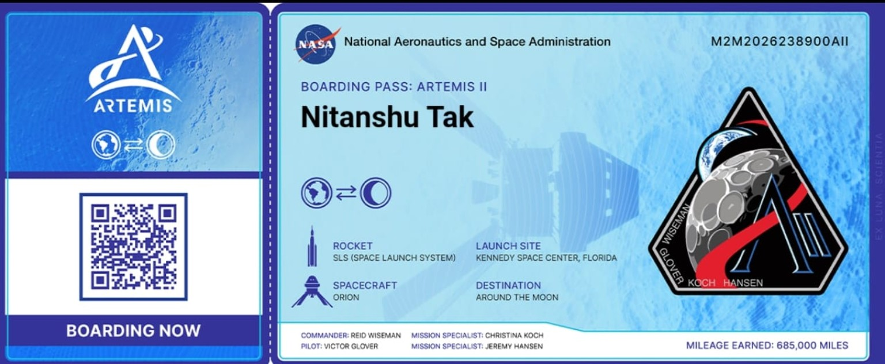

<div align="center">

<!-- ═══════════════════════════════════════════════════════════ -->
<!--      NITANSHU TAK · SYSTEMS & CLOUD ARCHITECT MATRIX        -->
<!-- ═══════════════════════════════════════════════════════════ -->


<br/>


<br/>

<!-- TOP TACTICAL NAVIGATION CHIPS -->
<a href="https://nt-matter.me"></a>
&nbsp;
<a href="https://linkedin.com/in/nitanshu-tak-89a1ba289"></a>
&nbsp;
<a href="https://github.com/Nitanshu715"></a>
&nbsp;
<a href="mailto:nitanshutak070105@gmail.com"></a>
&nbsp;
<a href="https://unstop.com/u/nitantak2514"></a>

</div>

<br/>

---

### // 01. OPERATOR MANIFESTO & TELEMETRY

```ini
[OPERATOR]        Nitanshu Tak
[TITLE]           SDE · Backend & Distributed Systems Architect
[LOCATION]        India
[LIVE_PLATFORM]   https://nt-matter.me
[SYSTEM_STATUS]   ONLINE // MK-XII CLEARANCE ACTIVE
[CORE_MISSION]    "Infrastructure whispers before collapse. I engineer the systems that listen."
```

<div align="center">


```mermaid
graph LR
    subgraph INGESTION["01 · OBSERVABILITY & INGESTION"]
        A["Real-Time Logs & Metrics"] --> B["eBPF / Prometheus / CloudWatch"]
    end
    subgraph INTELLIGENCE["02 · ML REASONING & ANOMALY DETECTION"]
        B --> C["Isolation Forest / Random Forest"]
        C --> D["QUBO / QAOA Quantum Scheduler"]
    end
    subgraph AUTONOMY["03 · AUTONOMOUS HEALING & CONTROL"]
        D --> E["MAPE-K Control Plane"]
        E --> F["Zero-Downtime Auto-Remediation"]
    end

    style INGESTION fill:#0d1117,stroke:#8a6a1f,stroke-width:1.5px
    style INTELLIGENCE fill:#0d1117,stroke:#c9a84c,stroke-width:1.5px
    style AUTONOMY fill:#0d1117,stroke:#9e120b,stroke-width:1.5px
```

</div>

---

### // 02. SYSTEM TECH ARSENAL

<div align="center">


<br/><br/>


</div>

---

### // 03. VERIFIED CERTIFICATIONS ORBITAL CORE

<div align="center">

<table>
  <tr>
    <td align="center" width="30%">
      <br/>
      <sub>Continuous delivery pipelines, IaC, OKE, container registries & SRE automation</sub>
    </td>
    <td align="center" width="40%" rowspan="2">
      <!-- CENTRAL SPINNING COIN ARTIFACT (LINKS BACK TO NT-MATTER.ME) -->
      <a href="https://nt-matter.me" target="_blank">
        
      </a>
      <br/><br/>
      <a href="https://nt-matter.me">
        
      </a>
      <br/>
      <sub><i>Tap center emblem to launch 3D Double Helix terminal</i></sub>
    </td>
    <td align="center" width="30%">
      <br/>
      <sub>Multi-cloud networking, zero-trust security & high-availability topology</sub>
    </td>
  </tr>
  <tr>
    <td align="center" width="30%">
      <br/>
      <sub>Triple AWS Graduate: Foundations · Architecting · Operations</sub>
    </td>
    <td align="center" width="30%">
      <br/>
      <sub>Diamond League & Trooper Tier · Top percentile cloud execution</sub>
    </td>
  </tr>
</table>

</div>

---

### // 04. PRODUCTION REPOSITORIES & ARCHITECTURAL HIGHLIGHTS

| Repository | Domain | Tech Stack | Architectural Accomplishment |
|:---|:---|:---|:---|
| [**Helios**](https://github.com/Nitanshu715/Helios) | AI Security & Self-Healing | Python · Flask · scikit-learn · AWS EC2/S3/CloudWatch/SNS | 5 ML anomaly detection models (>95% accuracy) with real-time autonomous auto-recovery pipeline. **ICATEET 2026 Conference Research Paper.** |
| [**Quantum-Cloud**](https://github.com/Nitanshu715/Quantum-Cloud) | Quantum Cloud Scheduling | Python · Qiskit · QAOA · QUBO/Ising · AWS Braket | QUBO Hamiltonian cloud scheduler with QAOA & Simulated Annealing. **35% lower cost than greedy algorithms.** |
| [**MediFlow AI**](https://github.com/Nitanshu715/MediFlow-AI) | Autonomous GenAI Pipeline | Next.js 14 · TypeScript · Claude API · Vercel | 5-agent clinical NLP claims pipeline. Clinical Extraction → Compliance → Auth → Adjudication → Audit. **6 hrs → 28 sec.** |
| [**ATLAS-SRE**](https://github.com/Nitanshu715/Atlas-SRE) | SRE & Kubernetes Reliability | AWS EKS · Prometheus · Grafana · ALB · Docker | Production K8s cluster with Chaos engineering failure injection. **99.9% uptime · 65% MTTD reduction.** |
| [**NitanshuOS**](https://github.com/Nitanshu715/NitanshuOS) | OS Engineering | Linux 5.10 · Buildroot · GRUB · BusyBox · QEMU | Custom bootable Linux distribution engineered from scratch with 5-stage automated disk pipeline. **>60% smaller than standard distros.** |
| [**SuryaDrishti**](https://github.com/Nitanshu715/SuryaDrishti) | Geospatial AI & Climate | Python · scikit-learn · Rasterio · GDAL · Landsat 9 | Random Forest classifier trained on 1.45M satellite pixels for Urban Heat Island mapping. **95.99% accuracy · F1=0.962.** |
| [**Navika**](https://github.com/Nitanshu715/Navika) | Financial RAG System | Python · FAISS · MiniLM · Gemini 2.5 Flash · Reflex | Grounded financial inference engine with 384-dim dense retrieval. **MRR=0.812 · 90% Hit@5. Top 100 / 7,000+ teams.** |
| [**ARES**](https://github.com/Nitanshu715/ARES-Autonomous-Reliability-Engineering-System) | Autonomous SRE Control Plane | Next.js · TypeScript · Python · Docker Engine API · Prometheus | MAPE-K control plane executing autonomous container remediation and self-healing. **108+ Vercel deployments.** |
| [**Kevlar**](https://github.com/Nitanshu715/Kevlar) | Cybersecurity & Defense | Python · Flask · Random Forest · Chrome Manifest V3 | 4-layer browser security suite with ~96% phishing detection accuracy across 96k evaluated URLs. **Ideathon Finalist.** |
| [**SAL-SHIELD**](https://github.com/Nitanshu715/Sal-Shield) | Environmental AI Intelligence | Python · TensorFlow · XGBoost · CNN · Sentinel-2 · GIS | Satellite analytics and CNN-based forest intelligence platform for early borer infestation detection. **XGBoost 97.5% · CNN 92.7%.** |
| [**NebulaStack**](https://github.com/Nitanshu715/NebulaStack) | Cloud IaC Infrastructure | AWS EC2 · RDS · Docker · Terraform · ECR | Zero-drift declarative IaC architecture with Git SHA container versioning and strict IAM least-privilege policies. |
| [**Prism**](https://github.com/swaskiee/Prism-AI-Hiring-Intelligence-Platform) | AI Semantic Intelligence | Python · Pandas · TF-IDF · TruncatedSVD · scikit-learn | 5-layer candidate ranking pipeline processing 100K profiles with LSA semantic scoring. **76.4s runtime · 100% anomaly detection.** |
| **Cloud DSL Compiler** *(Patent Pending)* | Compilers & Cloud Systems | Java · ANTLR4 · Docker · Kubernetes · AWS ECS | Patent-granted 6-phase compiler translating custom cloud DSL into production Kubernetes manifests. **150 lines → 5 lines reduction.** |
| [**GigForge**](https://github.com/Nitanshu715/GigForge-Gig-Worker-Infrastructure) | FinTech Infrastructure | Next.js · TypeScript · PostgreSQL · Prisma · RBAC | Append-only financial ledger with OTP auth, insurance contribution tracking, and worker administration workflows. |

---

### // 05. VERIFIED OPEN SOURCE PRODUCTION PULL REQUESTS

<div align="center">


&nbsp;

&nbsp;

&nbsp;


</div>

| # | Target Repository | Verified Merged PR | Technical Root Cause & Architecture Fix | Repo Stars |
|:--|:---|:---|:---|:---|
| 01 | [hemasriaavala/python-mini-projects](https://github.com/hemasriaavala/python-mini-projects) | [PR #8](https://github.com/hemasriaavala/python-mini-projects/pull/8) | **LRU Cache O(1) Core**: Implemented complete `LRUCache` using `OrderedDict` with deterministic eviction test cases. | Community |
| 02 | [SdSarthak/AegisAI](https://github.com/SdSarthak/AegisAI) | [PR #1545](https://github.com/SdSarthak/AegisAI/pull/1545) | **Guard SDK PyPI Packaging**: Standardized `pyproject.toml` (Hatchling build) + GitHub Actions automated PyPI deployment. | ★90+ |
| 03 | [JhaSourav07/commitpulse](https://github.com/JhaSourav07/commitpulse) | [PR #8052](https://github.com/JhaSourav07/commitpulse/pull/8052) | **Grace Period Dead Code Elimination**: Removed unconditional overwrite bug restoring user streak grace period validation. | ★137 |
| 04 | [JhaSourav07/commitpulse](https://github.com/JhaSourav07/commitpulse) | [PR #8054](https://github.com/JhaSourav07/commitpulse/pull/8054) | **SSR Hydration Mismatch**: Eliminated Next.js 18 client/server mismatch in `useLocalStorage` via lazy state initialization. | ★137 |
| 05 | [JhaSourav07/commitpulse](https://github.com/JhaSourav07/commitpulse) | [PR #8056](https://github.com/JhaSourav07/commitpulse/pull/8056) | **TTLCache Asymmetric Key Validation**: Fixed silent key corruption across `get()`, `has()`, and `delete()` methods. | ★137 |
| 06 | [JhaSourav07/commitpulse](https://github.com/JhaSourav07/commitpulse) | [PR #8058](https://github.com/JhaSourav07/commitpulse/pull/8058) | **useDebounce Zero-Delay Race Condition**: Corrected zero-delay execution path bypassing unnecessary event loop queues. | ★137 |
| 07 | [JhaSourav07/commitpulse](https://github.com/JhaSourav07/commitpulse) | [PR #8060](https://github.com/JhaSourav07/commitpulse/pull/8060) | **Unicode Surrogate Pair Corruption**: Replaced `.length` UTF-16 truncation in SVG builder with `Array.from(text)` code-points. | ★137 |
| 08 | [CodeGraphContext/CodeGraphContext](https://github.com/CodeGraphContext/CodeGraphContext) | [PR #1359](https://github.com/CodeGraphContext/CodeGraphContext/pull/1359) | **Critical Logger Engine**: Added missing `critical_logger()` core engine matching logger pipeline with 6 unit tests. | ★3,900+ |
| 09 | [CodeGraphContext/CodeGraphContext](https://github.com/CodeGraphContext/CodeGraphContext) | [PR #1360](https://github.com/CodeGraphContext/CodeGraphContext/pull/1360) | **HTML Graph Visualizer Engine**: Built 607-line zero-dependency interactive force-directed graph renderer + 23 test suites. | ★3,900+ |
| 10 | [CodeGraphContext/CodeGraphContext](https://github.com/CodeGraphContext/CodeGraphContext) | [PR #1361](https://github.com/CodeGraphContext/CodeGraphContext/pull/1361) | **Cypher Query Toolkit Invocation**: Resolved `TypeError` across 13 toolkit files by restoring missing `self` parameters. | ★3,900+ |

---

### // 06. NASA MISSION REGISTRY & SPACE COLLECTIBLES

<div align="center">


&nbsp;

&nbsp;


<br/><br/>

<table>
  <tr>
    <td align="center" width="50%">
      <b>MISSION 01: ARTEMIS II — LUNAR FLYBY</b><br/>
      <br/>
      <sub><b>Passenger:</b> Nitanshu Tak · <b>Vehicle:</b> SLS + Orion · <b>Mileage:</b> 685,000 Miles</sub>
    </td>
    <td align="center" width="50%">
      <b>MISSION 02: NANCY GRACE ROMAN SPACE TELESCOPE</b><br/>
      <br/>
      <sub><b>Passenger:</b> Nitanshu Tak · <b>Target:</b> L2 Lagrange Point · <b>Mileage:</b> 1,000,000 Miles</sub>
    </td>
  </tr>
</table>

</div>

---

### // 07. GITHUB LIVE ANALYTICS & TELEMETRY

<div align="center">


&nbsp;&nbsp;


<br/><br/>


</div>

---

### // 08. SECURE DISPATCH & RECEPTIONS

<div align="center">

<a href="https://nt-matter.me"></a>
&nbsp;
<a href="https://linkedin.com/in/nitanshu-tak-89a1ba289"></a>
&nbsp;
<a href="https://github.com/Nitanshu715"></a>
&nbsp;
<a href="mailto:nitanshutak070105@gmail.com"></a>

<br/><br/>


</div>
