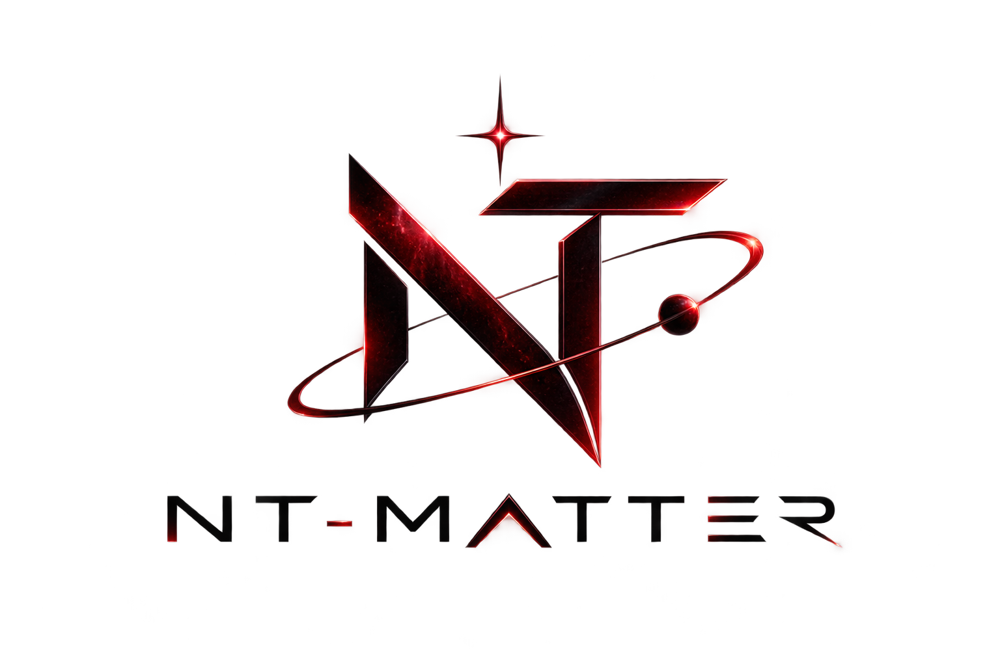
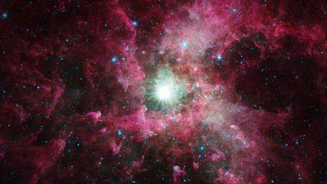
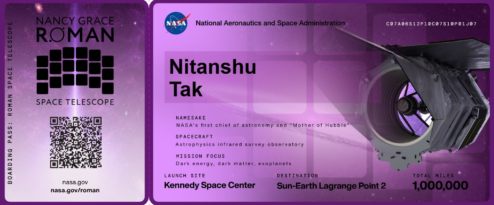

<div align="center">

<!-- ═══════════════════════════════════════════════════════════════════ -->
<!--        NITANSHU TAK · SYSTEMS & DISTRIBUTED CLOUD ARCHITECT         -->
<!-- ═══════════════════════════════════════════════════════════════════ -->


<a href="https://nt-matter.me"></a>
&nbsp;
<a href="https://linkedin.com/in/nitanshu-tak-89a1ba289"></a>
&nbsp;
<a href="https://github.com/Nitanshu715"></a>
&nbsp;
<a href="mailto:nitanshutak070105@gmail.com"></a>
&nbsp;
<a href="https://unstop.com/u/nitantak2514"></a>

</div>

---

### // 01. OPERATOR MANIFESTO

```ini
[OPERATOR]        Nitanshu Tak
[TITLE]           SDE · Backend & Distributed Systems Architect
[LOCATION]        India
[CLEARANCE]       LEVEL 12 · HIGH-CONCURRENCY SYSTEMS
[LIVE_PLATFORM]   https://nt-matter.me
[CORE_PRINCIPLE]  "Infrastructure whispers before collapse. I engineer the systems that listen."
```

I build production-grade infrastructure that thinks, detects, and heals:
- **Autonomous Cloud Platforms & Self-Healing Engines**: Closed-loop control planes that intercept anomalies and auto-remediate without human latency.
- **Machine Learning-Driven Threat Detection**: Unsupervised and supervised anomaly models parsing high-throughput metrics.
- **AI Observability & Multi-Agent Pipelines**: Coordinated clinical NLP and reasoning agent fleets.
- **Low-Level Systems & Kernel Engineering**: Custom bootable Linux distros built from scratch with automated disk pipelines.
- **Quantum-Classical Hybrid Schedulers**: QAOA/QUBO Hamiltonian solvers optimizing cloud resource allocation.

<div align="center">


```mermaid
graph LR
    subgraph INGESTION["01 · OBSERVABILITY & INGESTION"]
        A["Real-Time Logs & Telemetry"] --> B["eBPF / Prometheus / CloudWatch"]
    end
    subgraph INTELLIGENCE["02 · ML REASONING & ANOMALY DETECTION"]
        B --> C["Isolation Forest / Random Forest"]
        C --> D["QUBO / QAOA Quantum Scheduler"]
    end
    subgraph AUTONOMY["03 · AUTONOMOUS HEALING & CONTROL"]
        D --> E["MAPE-K Control Plane"]
        E --> F["Zero-Downtime Auto-Remediation"]
    end

    style INGESTION fill:#0d1117,stroke:#8a6a1f,stroke-width:1.5px
    style INTELLIGENCE fill:#0d1117,stroke:#c9a84c,stroke-width:1.5px
    style AUTONOMY fill:#0d1117,stroke:#9e120b,stroke-width:1.5px
```

</div>

---

### // 02. SYSTEM TECH ARSENAL

<div align="center">


</div>

---

### // 03. VERIFIED CREDENTIALS & CERTIFICATION CORE

<div align="center">

<a href="https://nt-matter.me" target="_blank">
  
</a>
<br/>
<a href="https://nt-matter.me" target="_blank">
  
</a>

<p align="center" style="margin-top: 8px; margin-bottom: 4px;">
  
  &nbsp;
  
</p>

<p align="center" style="margin-top: 4px; margin-bottom: 4px;">
  
  &nbsp;
  
  &nbsp;
  
</p>

<p align="center" style="margin-top: 4px; margin-bottom: 8px;">
  
  &nbsp;
  
</p>

</div>

| Credential / Certification | Issuing Body | Architectural Specialization & Core Competencies |
|:---|:---|:---|
| **OCI DevOps Professional** | Oracle Cloud | Automated CI/CD pipelines, OKE Kubernetes clusters, IaC with Terraform, zero-downtime blue/green deployments, and SRE observability automation. |
| **OCI Multicloud Architect** | Oracle Cloud | Enterprise multi-cloud architecture, cross-cloud interconnects (AWS/Azure/GCP), high availability HA/DR topologies, and zero-trust IAM security. |
| **AWS Academy: Cloud Architecting** | Amazon Web Services | Distributed system design, high-throughput VPC topologies, serverless microservices, resilient fault tolerance, and multi-tier database scaling. |
| **Google Cloud Arcade: Diamond League** | Google Cloud | 14,852 earned points · Diamond League & Trooper Tier rank in hands-on production labs covering Cloud Run, IAM, GKE, BigQuery, and hybrid networking. |
| **AWS Academy: Cloud Operations** | Amazon Web Services | Systems operations, CloudWatch observability & telemetry, automated resource scaling, backup policies, compliance, and disaster recovery. |
| **AWS Academy: Cloud Foundations** | Amazon Web Services | Core cloud computing architecture, storage tiers (S3/EBS/EFS), compute virtualization (EC2), security compliance, and cost optimization models. |
| **AWS Cloud Practitioner** | GeeksForGeeks | Foundational AWS cloud infrastructure, billing structures, security guardrails, and cloud deployment lifecycle. |

---

### // 04. PRODUCTION REPOSITORIES & ENGINEERING HIGHLIGHTS

| Repository | Domain | Core Tech | What It Actually Does |
|:---|:---|:---|:---|
| [**Helios**](https://github.com/Nitanshu715/Helios) | AI Security + Self-Healing | Python · Flask · scikit-learn · AWS EC2/S3/CloudWatch/SNS | 5 ML models (CPU, Network, Login, Injection, Storage). >95% accuracy. Real-time auto-recovery pipeline. **Research Paper applied for publishing at ICATEET 2026.** |
| [**Quantum-Cloud**](https://github.com/Nitanshu715/Quantum-Cloud) | Quantum-Classical Cloud Scheduler | Python · Qiskit · QAOA · QUBO/Ising Optimization · Streamlit | QUBO Hamiltonian cloud scheduler solving job allocation via QAOA, Simulated Annealing, and exact search. **35% lower cost than greedy algorithms**, validated against brute-force optimum. |
| [**MediFlow AI**](https://github.com/Nitanshu715/MediFlow-AI) | GenAI + Healthcare | Next.js 14 · TypeScript · Claude API · Vercel | 5-agent autonomous claims pipeline. Clinical NLP → Compliance → Auth → Adjudication → Audit. **6 hrs → 28 sec runtime.** ET GenAI Hackathon 2026. |
| [**ATLAS-SRE**](https://github.com/Nitanshu715/Atlas-SRE) | SRE + Kubernetes Reliability | AWS EKS · Prometheus · Grafana · ALB · Docker | Production K8s cluster. Chaos engineering failure injection + verified self-healing. **99.9% uptime · 65% MTTD reduction.** |
| [**NitanshuOS**](https://github.com/Nitanshu715/NitanshuOS) | OS Engineering | Linux 5.10 · Buildroot · GRUB · BusyBox · QEMU · Docker | Custom Linux distro built from scratch. 5-stage automated disk pipeline. Boots on QEMU. **>60% smaller than standard distros.** |
| [**SuryaDrishti**](https://github.com/Nitanshu715/SuryaDrishti) | Geospatial AI | Python · scikit-learn · Rasterio · GDAL · Flask · Landsat 9 | Random Forest on 1.45M satellite pixels. **95.99% accuracy · F1=0.962.** Delhi Urban Heat Island mapping. ISRO/NRSC portfolio. |
| [**Navika**](https://github.com/Nitanshu715/Navika) | RAG + Finance | Python · FAISS · MiniLM · Gemini API · Reflex | MiniLM 384-dim embeddings + FAISS. Gemini 2.5 Flash grounded inference. **MRR=0.812 · 90% Hit@5. Top 100 / 7,000+ teams.** |
| [**ARES**](https://github.com/Nitanshu715/ARES-Autonomous-Reliability-Engineering-System) | Autonomous SRE Control Plane | Next.js · TypeScript · Python · Docker Engine API · Prometheus | MAPE-K control plane. Multi-agent self-healing. Docker Engine API remediation. **108+ Vercel deployments.** |
| [**Kevlar**](https://github.com/Nitanshu715/Kevlar) | Cybersecurity Automation | Python · Flask · Random Forest · Chrome Manifest V3 | 4-layer browser security suite. ~96% phishing accuracy on 96k URLs. URL risk + HTTPS + scam text layers. **Ideathon Finalist.** |
| [**SAL-SHIELD**](https://github.com/Nitanshu715/Sal-Shield) | Geospatial AI + Forest Intelligence | Python · TensorFlow · XGBoost · Random Forest · CNN · React · Sentinel-2 | Forest intelligence platform for early detection of Sal Borer infestation. Combines satellite analytics, CNN tree classification, and geospatial risk mapping. **XGBoost 97.5% · CNN 92.7% · RF 88.8%.** |
| [**NebulaStack**](https://github.com/Nitanshu715/NebulaStack) | Cloud IaC | AWS EC2 · RDS · Docker · Terraform · ECR | Git SHA image versioning · Terraform-only provisioning · SSL-enforced RDS · IAM least-privilege policies. |
| [**Prism**](https://github.com/swaskiee/Prism-AI-Hiring-Intelligence-Platform) | AI + Hiring Intelligence | Python · Pandas · TF-IDF · TruncatedSVD · scikit-learn | 5-layer hybrid candidate-ranking pipeline. 100K profiles · TF-IDF + LSA semantic scoring · Behavioral trust modeling · **76.4s runtime · 100% anomaly detection.** |
| **Cloud DSL Compiler** *(Patent Pending)* | Compilers + Systems | Java · ANTLR4 · Docker · Kubernetes · AWS ECS | Patent-granted infrastructure compiler implementing a 6-phase compilation pipeline (Lexer → Parser → AST → Semantic → IR → Codegen). Compiles cloud DSL into Dockerfiles, K8s manifests, and ECS tasks. **150 lines → 5 lines reduction.** |
| [**GigForge**](https://github.com/Nitanshu715/GigForge-Gig-Worker-Infrastructure) | FinTech + Full Stack | Next.js · TypeScript · PostgreSQL · Prisma · RBAC | Production-grade workforce and insurance infrastructure for India's gig economy. Append-only financial ledger, OTP authentication, worker onboarding, and role-based administration workflows. |

<div align="center">
  
</div>

---

### // 05. OPEN SOURCE CONTRIBUTIONS · PRODUCTION REPOSITORIES

<div align="center">


&nbsp;

&nbsp;

&nbsp;


</div>

**10 merged pull requests across 4 repositories.** Every one is a real, verified bug fix or feature — not a documentation edit, not a typo fix, not a README tweak.

| # | Repository | Verified PR | What Was Broken · What I Fixed | Stars |
|---|---|---|---|---|
| 1 | [hemasriaavala/python-mini-projects](https://github.com/hemasriaavala/python-mini-projects) | [#8](https://github.com/hemasriaavala/python-mini-projects/pull/8) | **LRU Cache O(1) Implementation** — Added a complete Python `LRUCache` using `OrderedDict`, with O(1) `get()`/`put()` and eviction test cases | community repo |
| 2 | [SdSarthak/AegisAI](https://github.com/SdSarthak/AegisAI) | [#1545](https://github.com/SdSarthak/AegisAI/pull/1545) | **Guard SDK PyPI Packaging** — Added `pyproject.toml` (Hatchling build backend), optional ML dependencies, and a GitHub Actions publish workflow; unblocked `pip install aegisai-guard` | ★90+ |
| 3 | [JhaSourav07/commitpulse](https://github.com/JhaSourav07/commitpulse) | [#8052](https://github.com/JhaSourav07/commitpulse/pull/8052) | **Grace Period Dead Code** — An unconditional `todayIndex = lastIndex` overwrote the grace-period check in every case; removed the 1 dead line that made the whole feature non-functional | ★137 |
| 4 | [JhaSourav07/commitpulse](https://github.com/JhaSourav07/commitpulse) | [#8054](https://github.com/JhaSourav07/commitpulse/pull/8054) | **SSR Hydration Mismatch** — `useLocalStorage` caused a Next.js/React 18 hydration warning; fixed with a lazy `useState` initializer, eliminating an unnecessary extra render | ★137 |
| 5 | [JhaSourav07/commitpulse](https://github.com/JhaSourav07/commitpulse) | [#8056](https://github.com/JhaSourav07/commitpulse/pull/8056) | **TTLCache Asymmetric Validation** — `cache.get(" ")` silently succeeded while `cache.set(" ", ...)` correctly threw; unified whitespace-key validation across `get()`, `has()`, and `delete()` | ★137 |
| 6 | [JhaSourav07/commitpulse](https://github.com/JhaSourav07/commitpulse) | [#8058](https://github.com/JhaSourav07/commitpulse/pull/8058) | **useDebounce Zero-Delay Behavior** — `delay === 0` still queued through `setTimeout`; traced this to an explicit test contract and aligned the implementation and docs to match the intended behavior | ★137 |
| 7 | [JhaSourav07/commitpulse](https://github.com/JhaSourav07/commitpulse) | [#8060](https://github.com/JhaSourav07/commitpulse/pull/8060) | **Unicode Surrogate Pair Truncation** — The SVG error-badge builder truncated text using `.length` (UTF-16 code units), corrupting emoji/CJK output; fixed with `Array.from(text)` for correct Unicode code-point handling | ★137 |
| 8 | [CodeGraphContext/CodeGraphContext](https://github.com/CodeGraphContext/CodeGraphContext) | [#1359](https://github.com/CodeGraphContext/CodeGraphContext/pull/1359) | **`critical_logger()` — Complete Log Level Coverage** — `debug_log.py` defined `CRITICAL` in `LOG_LEVELS` but had no matching logger function; added it, matching the existing `info_logger`/`warning_logger`/`error_logger` pattern exactly, plus 6 unit tests | ★3,900+ |
| 9 | [CodeGraphContext/CodeGraphContext](https://github.com/CodeGraphContext/CodeGraphContext) | [#1360](https://github.com/CodeGraphContext/CodeGraphContext/pull/1360) | **`visualize_graph.py` — HTML Graph Renderer (built from scratch)** — Implemented a 607-line, zero-dependency force-directed graph visualizer (dark mode, hover tooltips, directed-edge arrows, auto-legend) plus 23 unit tests | ★3,900+ |
| 10 | [CodeGraphContext/CodeGraphContext](https://github.com/CodeGraphContext/CodeGraphContext) | [#1361](https://github.com/CodeGraphContext/CodeGraphContext/pull/1361) | **Missing `self` Parameter Across 13 Toolkits** — Every placeholder language toolkit's `get_cypher_query()` was missing `self`, causing a `TypeError` instead of the intended `NotImplementedError`; fixed identically across all 13 files, plus 31 parametrized tests | ★3,900+ |

---

### // 06. AWARDS, HONORS & COMPETITIVE EXCELLENCE

<table>
  <tr>
    <td align="center" width="50%">
      <br/>
      <b>Global Top 0.21% - Unstop Competitions</b><br/>
      <sub>University Rank 2 &nbsp;·&nbsp; Top performers nationally across 500,000+ competitors</sub>
    </td>
    <td align="center" width="50%">
      <br/>
      <b>Unstop Talent Awards 2026 - Nominee</b><br/>
      <sub>Nominated among India's top student builders and competition performers</sub>
    </td>
  </tr>
  <tr>
    <td align="center" width="50%">
      <br/>
      <b>Algoverse AI Research Program — Admitted with Scholarship</b><br/>
      <sub>Selected for international LLM & Applied ML Research cohort</sub>
    </td>
    <td align="center" width="50%">
      <br/>
      <b>GirlScript Summer of Code 2026 — Selected</b><br/>
      <sub>Accepted into Open Source Track and AI/Agents Track</sub>
    </td>
  </tr>
  <tr>
    <td align="center" width="50%">
      <br/>
      <b>Author & Presenter - ICATEET 2026</b><br/>
      <sub>Author of "Helios: AI-Enabled Secure Cloud Infrastructure"</sub>
    </td>
    <td align="center" width="50%">
      <br/>
      <b>ET GenAI Hackathon 2026 - Semi-Finalist</b><br/>
      <sub>MediFlow AI - Autonomous 5-Agent Healthcare Claims Pipeline</sub>
    </td>
  </tr>
  <tr>
    <td align="center" width="50%">
      <br/>
      <b>Top 100 / 7,000+ Teams - Hack For Green Bharat</b><br/>
      <sub>Built "Navika" - RAG-Based Financial Intelligence Platform</sub>
    </td>
    <td align="center" width="50%">
      <br/>
      <b>Google Cloud Arcade 2025 - Diamond League & Trooper Tier</b><br/>
      <sub>14,852 Points · Top-tier performance in the national cohort</sub>
    </td>
  </tr>
  <tr>
    <td align="center" width="50%">
      <br/>
      <b>National Quantum Computing Hackathon 2025</b><br/>
      <sub>Designed and built a QAOA-Based Cloud Resource Scheduler on Qiskit</sub>
    </td>
    <td align="center" width="50%">
      <br/>
      <b>Ideathon 1.0 - Finalist (Solo)</b><br/>
      <sub>Kevlar - ML-Powered Browser Security Suite</sub>
    </td>
  </tr>
  <tr>
    <td align="center" width="50%">
      <br/>
      <b>HP Power Lab 2.0 - Campus Winner</b><br/>
      <sub>Campus-level winners in HP Inc.'s national innovation challenge</sub>
    </td>
    <td align="center" width="50%">
      <br/>
      <b>Hero Campus Challenge Season 10 - Winner</b><br/>
      <sub>Winners list in the national online assessment round</sub>
    </td>
  </tr>
  <tr>
    <td align="center" width="50%">
      <br/>
      <b>NASA Artemis II & Roman Telescope Registry</b><br/>
      <sub>Name registered symbolically aboard NASA deep-space missions</sub>
    </td>
    <td align="center" width="50%">
      <br/>
      <b>Campus Ambassador — IIT Roorkee · IIT Delhi · IIM Indore</b><br/>
      <sub>Core Technical Committee Member, UPES CSA Chapter</sub>
    </td>
  </tr>
</table>

---

### // 07. NASA MISSION REGISTRY & SPACE COLLECTIBLES

<div align="center">


&nbsp;

&nbsp;


<br/>
<i>Symbolic participation in two iconic NASA missions advancing human exploration of the universe.</i>

</div>

#### 🌕 Artemis II — Lunar Flyby Mission

<div align="center">
  
  <br/>
  <b>Passenger:</b> Nitanshu Tak &nbsp;·&nbsp; <b>Mission:</b> Artemis II – Lunar Flyby<br/>
  <b>Launch Site:</b> Kennedy Space Center, Florida &nbsp;·&nbsp; <b>Launch Vehicle:</b> Space Launch System (SLS) 🚀<br/>
  <b>Spacecraft:</b> Orion Crew Capsule &nbsp;·&nbsp; <b>Distance:</b> 685,000 Miles
</div>

#### 🔭 Nancy Grace Roman Space Telescope

<div align="center">
  
  <br/>
  <b>Passenger:</b> Nitanshu Tak &nbsp;·&nbsp; <b>Mission:</b> Nancy Grace Roman Space Telescope<br/>
  <b>Destination:</b> Sun–Earth Lagrange Point 2 (L2) &nbsp;·&nbsp; <b>Launch Site:</b> Kennedy Space Center, Florida<br/>
  <b>Mission Focus:</b> Dark Energy · Dark Matter · Exoplanets &nbsp;·&nbsp; <b>Distance:</b> 1,000,000 Miles
</div>

---

<div align="center">

<a href="https://nt-matter.me"></a>
&nbsp;
<a href="https://linkedin.com/in/nitanshu-tak-89a1ba289"></a>
&nbsp;
<a href="https://github.com/Nitanshu715"></a>
&nbsp;
<a href="mailto:nitanshutak070105@gmail.com"></a>
&nbsp;
<a href="https://unstop.com/u/nitantak2514"></a>


<b>Infrastructure whispers before collapse. I engineer the systems that listen.</b>

</div>
