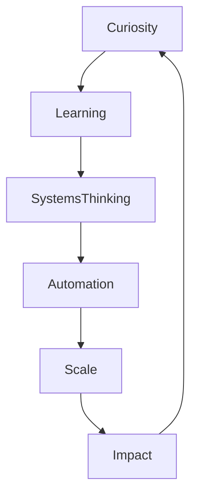

<!-- ============ HERO HEADER ============ -->

  

  

  <b>BTech CSE (Cloud Computing & Virtualization Technology) @ UPES • Dehradun, India</b> 
  <b>Cloud × AI/ML × Security × Systems</b>

---

## ⚡ Who I Am

I’m **Nitanshu**, a systems-focused engineer building:

- Autonomous cloud platforms  
- ML-driven threat detection engines  
- Self-healing infrastructure  
- AI observability agents  
- Custom Linux operating systems  

I don’t build “apps for marks”.  
I build **infrastructure that thinks, detects, and heals**.

---

# NITANSHU TAK  
### SYSTEMS • CLOUD • AI • SECURITY • DEVOPS • SRE • ML

══════════════════════════════════════════════════════════

<b>COGNITIVE ARCHITECTURE</b>

<table>
<tr><td width="50%">

**Thinking Model**  
Optimization-first  
Systems over shortcuts  
Depth over surface  

</td><td width="50%">

**Stress Handling**  
Processing priority elevated  
Noise suppressed  
Focus channel locked  

</td></tr>
</table>

══════════════════════════════════════════════════════════

## SYSTEM PROFILE

<b>CORE OPERATING MODES</b>

| Mode | State |
|------|------|
| Research | Active |
| Build | Default |
| Debug | Triggered by failure |
| Exploration | Continuous |

══════════════════════════════════════════════════════════

<b>COGNITIVE NETWORK MAP</b>

══════════════════════════════════════════════════════════

<b>ENGINEERING LAWS</b>

1. Anything repetitive must be automated  
2. Systems must be observable  
3. Failure is expected — recovery is engineered  
4. Intelligence belongs inside infrastructure  

══════════════════════════════════════════════════════════

<b>ACTIVE THOUGHT STACK</b>

• Autonomous infrastructure  
• AI inside monitoring systems  
• Reducing human-in-the-loop ops  
• Deep system observability  

══════════════════════════════════════════════════════════

<b>SIGNAL STATUS</b>

Status: Online  
Mode: Building  
Signal Strength: ██████████  
Location: Earth  

══════════════════════════════════════════════════════════

**INFRASTRUCTURE WHISPERS BEFORE COLLAPSE. SYSTEMS LISTEN.**

---

## ⚙️ Animated Tech Arsenal

  

  

---

## 🧠 Core Engineering Domains

- Cloud Automation & DevOps Pipelines  
- AI-Based Threat Detection  
- Self-Healing Infrastructure  
- Cybersecurity Automation  
- Linux OS Engineering & Virtualization  
- ML Observability & Telemetry  

---

## 🚨 Project Highlights

| Project | Domain | Core Tech | What It Actually Does |
|--------|--------|-----------|------------------------|
| **Helios** | AI Security + Self-Healing | Python, Flask, scikit-learn, AWS EC2, S3, IAM, CloudWatch, SNS | A real-time ML-powered anomaly detection & self-healing system. Detects CPU abuse, login intrusions, storage misuse & network anomalies. Triggers automatic alerts and recovery actions without human intervention. |
| **LuminaML** | Explainable AI Platform | Python, Streamlit, TensorFlow, Pandas, NumPy | Builds transparent prediction pipelines for economic & financial data. Shows exact reasoning behind every ML output instead of black-box predictions. |
| **Observo** | AI Observability Agent | Python, OpenAI SDK, LogFire, AgentOps, Braintrust | Full ML inference observability with real-time tracing, debugging and cross-provider telemetry for AI pipelines. |
| **NitanshuOS** | Operating Systems | Buildroot, Linux Kernel, QEMU, Docker, Shell | Fully bootable custom Linux OS engineered from kernel config to root filesystem. Designed for kernel experimentation & virtualization testing. |
| **Kevlar** | Cybersecurity Automation | Python, Security Pipelines, Cloud Automation | Automated defensive security framework that detects threats and executes adaptive response workflows for hardened cloud environments. |
| **Pokémon Pokédex** | Computer Vision | Python, CNN, MobileNetV2, Streamlit | AI-powered Pokémon Pokédex that uses a deep learning CNN model to identify Pokémon from images with confidence scoring, stats extraction, and a full interactive web interface. |

  

## 🎓 Certifications

- OCI DevOps Professional – Oracle  
- OCI Multicloud Architect Professional – Oracle  
- AWS Cloud Practitioner  - Completion via GFG
- AWS Architecting  - AWS Academy
- AWS Operations - AWS Academy
- AWS Foundations - AWS Academy
---

## 🌐 Connect

  

---

  

<b>Infrastructure whispers before collapse. I engineer the systems that listen.</b>

